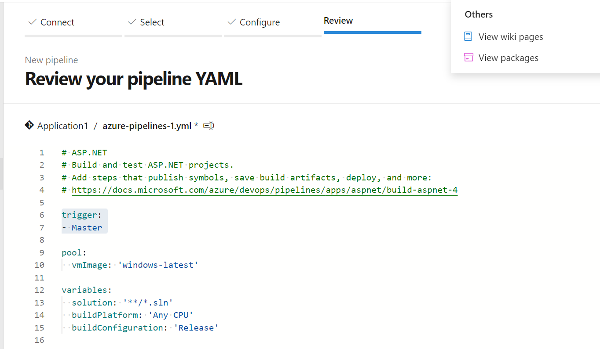

# devopstest
The below solution is for scenario 1 : 
A car rental company called FastCarz has a .net Web Application and Web API which are recently 
migrated from on-premise system to Azure cloud using Azure Web App Service
and Web API Service.
The on-premises system had 3 environments Dev, QA and Prod.
The code repository was maintained in TFS and moved to Azure GIT now. The TFS has daily builds which 
triggers every night which build the solution and copy the build package to drop folder.
deployments were done to the respective environment manually. The customer is planning to setup 
Azure DevOps Pipeline service for below requirements:

**1)The build should trigger as soon as anyone in the dev team checks in code to master branch.**
Continuous integration (CI) triggers cause a pipeline to run whenever user push an update to the specified branches.
YAML pipelines are configured by default with a CI trigger on all branches.Users can control which branches get CI triggers with a simple syntax:
```
trigger:
- master
- releases/*
```


