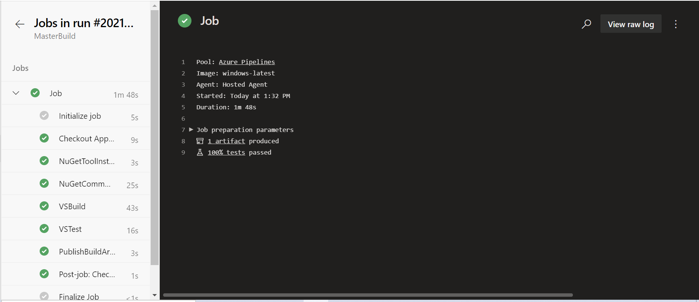
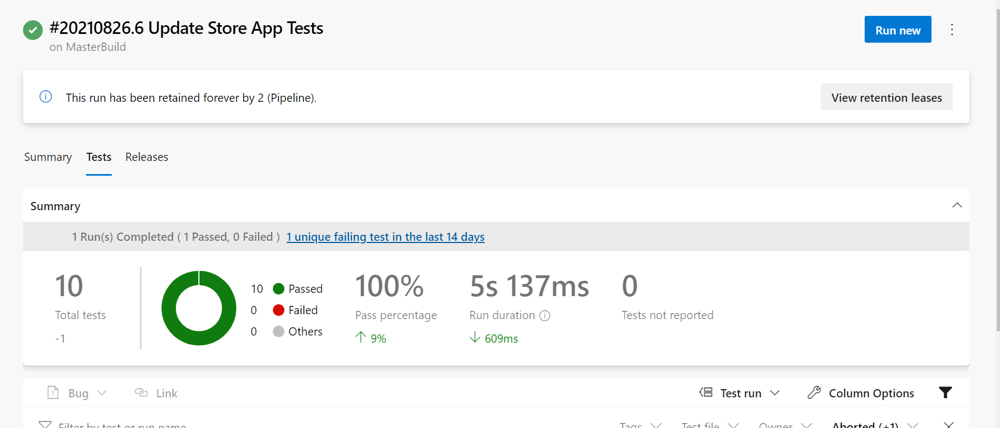

# devopstest
The below solution is for scenario 1 : 
A car rental company called FastCarz has a .net Web Application and Web API which are recently 
migrated from on-premise system to Azure cloud using Azure Web App Service
and Web API Service.
The on-premises system had 3 environments Dev, QA and Prod.
The code repository was maintained in TFS and moved to Azure GIT now. The TFS has daily builds which 
triggers every night which build the solution and copy the build package to drop folder.
deployments were done to the respective environment manually. The customer is planning to setup 
Azure DevOps Pipeline service for below requirements:

**1)The build should trigger as soon as anyone in the dev team checks in code to master branch.**
Continuous integration (CI) triggers cause a pipeline to run whenever user push an update to the specified branches.
YAML pipelines are configured by default with a CI trigger on all branches.Users can control which branches get CI triggers with a simple syntax:
```
trigger:
- master
- releases/*
```


**2)) There will be test projects which will create and maintained in the solution along the Web and API.**
**The trigger should build all the 3 projects - Web, API and test.**
 **The build should not be successful if any test fails.**
I have created a sample C# solution containing 3 projects:
1) ASP.NET Web API project
2) ASP.NET MVC Web Application
3) Unit Test Project

The unit test project contains test cases to test the methods defined in Web Api controller class. The test project creates a simple list of product and validate the results generated from methods defined for getting all products and getting a single product by ID.

1. Link to controller class : [ProductController.cs](Scenario1/Source/StoreApp/Controllers/ProductController.cs)
2. Link to test class : [UnitTest1.cs](Scenario1/Source/StoreApp.Tests/UnitTest1.cs)

Azure Pipelines provide Visual Studio Build Task to build solution using MSBuild. Users can also build project (.*proj) files , default value for this task is **\*.sln which means solution file in any folder in the repo. The solution build task will build all projects under a solution.

```
- task: VSBuild@1
  inputs:
    solution: '$(solution)'
    msbuildArgs: '/p:DeployOnBuild=true /p:WebPublishMethod=Package /p:PackageAsSingleFile=true /p:SkipInvalidConfigurations=true /p:DesktopBuildPackageLocation="$(build.artifactStagingDirectory)\WebApp.zip" /p:DeployIisAppPath="Default Web Site"'
    platform: '$(buildPlatform)'
    configuration: '$(buildConfiguration)'
```

Azure Pipelines provide Visual Studio Test Task to run unit and functional tests using Visual Studio Test Runner. Any failure during test case execution will result in failure of pipeline and it will not move to next tasks of publishing the build artifacts for release deployment.

```
- task: VSTest@2
  inputs:
    testSelector: 'testAssemblies'
    testAssemblyVer2: |
      **\*test*.dll
      !**\*TestAdapter.dll
      !**\obj\**
    searchFolder: '$(System.DefaultWorkingDirectory)'
```
1: Below screen shot is showing the pipeline execution when the test case execution failed and it aborted the pipeline execution:


2: Below screen shots are showing the pipeline execution when the test case execution was successful and it moved to the next task of publishing the build artifacts:



