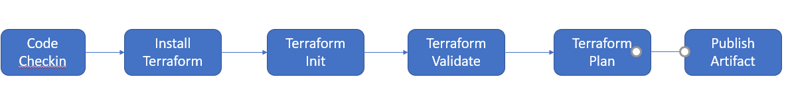
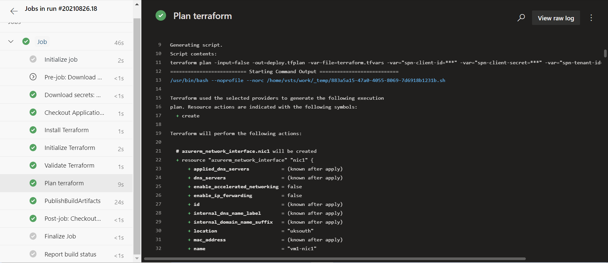
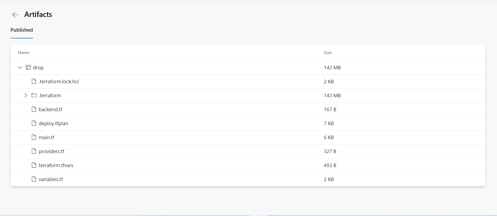
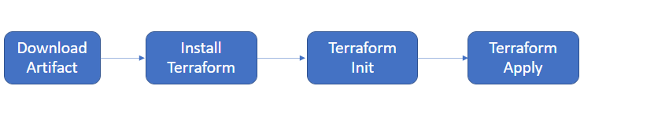
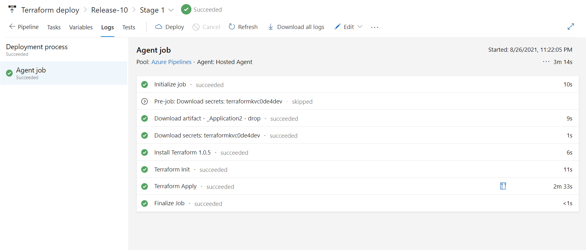
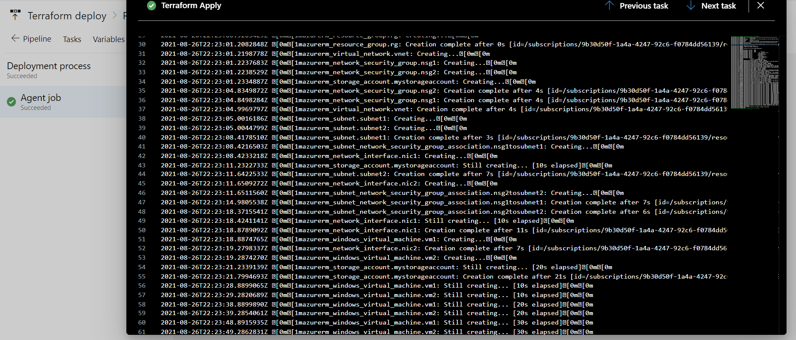
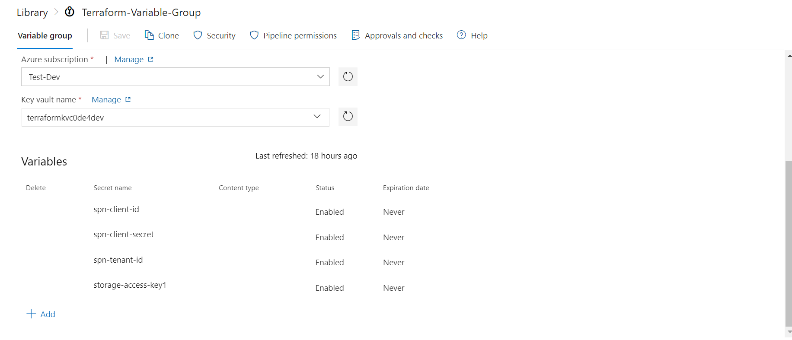

# Scenario2
Macro Life, a healthcare company has recently setup the entire Network and Infrastructure on Azure. 
The infrastructure has different components such as Virtual N/W, Subnets, NIC, IPs, NSG etc.
The IT team currently has developed PowerShell scripts to deploy each component where all the 
properties of each resource is set using PowerShell commands.
The business has realized that the PowerShell scripts are growing over period of time and difficult to 
handover when new admin onboards in the IT.
The IT team has now decided to move to Terraform based deployment of all resources to Azure.
All the passwords are stored in a Azure Service known as key Vault. The deployments needs to be 
automated using Azure DevOps using IaC(Infrastructure as Code)

**1) What are different artifacts you need to create - name of the artifacts and its purpose**

- **providers.tf**
When executing the terraform init command, Terraform will check that the version of the installed Terraform binary that executes the Terraform configuration file corresponds to the version specified in the required_version property of the terraform block.

```
terraform {
  required_providers {
    azurerm = {
      source  = "hashicorp/azurerm"
      version = "2.56.0"
   }
 }
}
```
Terraform relies on plugins called "providers" to interact with remote systems.Terraform configurations must declare which providers they require, so that Terraform can install and use them.When executing the terraform init command, if no version is specified, Terraform downloads the latest version of the provider, otherwise it downloads the specified version.After successful installation, Terraform writes information about the selected providers to the dependency lock file. 

To authenticate using SPN we need to do below as a pre-requisite:
 1. Create an Application in Azure Active Directory (which acts as a Service Principal)
 2. Grant the Application access to manage resources in the Azure Subscription

The Azure provider block defines syntax that allows users to specify Azure subscription's authentication information as below:

```
provider "azurerm" {
   features {}
   subscription_id = "9b30d50f-1a4a-4247-92c6-f0784dd56139"
   client_id = var.spn-client-id
   client_secret = var.spn-client-secret
   tenant_id = var.spn-tenant-id
}
```

- **backend.tf**
When executing the Terraform workflow commands, which are mainly terraform plan, terraform apply, and terraform destroy, Terraform has a mechanism that allows it to identify which resources need to be updated, added, or deleted. To perform this mechanism, Terraform maintains a file called a Terraform state file that contains all the details of the resources provisioned by Terraform. This Terraform state file is created the first time the terraform plan command is run and is updated with each action (apply or destroy).

If several people are working together, this file must be shared by everyone or, by default, this file is created on the local workstation or on the workstation that contains the Terraform binary.Any deletion of this local file or poor manual editing can affect the execution of Terraform configuration.

A solution to above problem is the use of a remote backend, which consists of storing this file in a remote, shared, and secure store.Terraform remote backend for Azure , azurerm, store the Terraform state file in an Azure Storage Account.

Below code is used to store state file in remote storage account container:
```
terraform {
   backend "azurerm" {
       storage_account_name = "terraformstorc0de4dev"
       container_name = "tfstate"
       key = "demo.terraform.tfstate"
   }
}
```
Terraform needs the value of storage account key to configure the remote backend which can be configured using below command:

```
terraform init -backend-config="access_key=[key_value]"
```
*key_value can be configured using environment variables on local system or pipeline variable in Azure Devops.*

- **variables.tf and terraform.tfvars**
When users write a Terraform configuration file where all the properties are hardcoded in the code, users often find themself faced with the problem of having to duplicate it in order to reuse it.They are input values used by code as configuration items. They are explicitly declared via one of the methods mentioned below :
1: variables files, variable.tf and variable.tfvars
2: Environment variables on the host where code is deployed from; these use the prefix TF_VAR eg TF_VAR_myvar=football
3: Flags passed to the terraform command for example terraform apply -var ‘myvar=football’

The *.tfvars file is used to define variables and the *.tf file declare that the variable exists.

**main.tf**
The main.tf file contains the Terraform configuration of the resources to be provisioned.
[main.tf](terraform/main.tf)


**2) List the tools you will to create and store the Terraform templates.**
I have used below tools to create and store Terraform templates:
1) Terraform Binary
2) Visual Studio Code
3) Hashicorp Terraform Extension for VS Code
4) Azure CLI tools
5) GIT 
6) Azure Devops Repo and pipelines
7) Azure Subscription(Free Account)

**3) Explain the process and steps to create automated deployment pipeline.**
I have used Azure Devops pipelines to automate the deployment process to Azure. Azure Devops pipeline needs to be authenticated with Azure subscription which was done by creating Azure AD SPN and granting permission to Azure subscriptions.

Azure Devops pipeline also provide automated tools that can be used to install the Terraform extension/task from Marketplace.The Terraform task enables running Terraform commands as part of Azure Build and Release Pipelines providing support for the following Terraform commands
init
validate
plan
apply
destroy

We can also use Command Line task to execute the above commands using Terraform CLI. I have used this method instead of using the Terraform Task from Marketplace.
The overall process is divided into CI Build pipeline and CD release pipeline. CI Build pipeline creates an artifact generated using terraform plan step, the CD release pipeline does the deployment to Azure using *.tfplan file.

**Create Deployment Package**
- Code Checkin:- Checkin the code in Azure Devops repo using pull or push.
- Install Terraform:- Terraform installer task to install the download and install the terraform on build host.
- Terraform Init:- Initialise terraform using remote azurerm backend to store the state file.This is done using Command Line task.
- Terraform Validate:- Validates the syntax and arguments of the Terraform configuration files in the repo, including argument and attribute names and types for resources.This is done using Command Line task.
- Terraform Plan:- Plan terraform using Command Line task to generate an executable plan.This is done using Command Line task.
- Publish Artifact:- Publish the artifact that has both the git content and the Terraform executable plan file.



Below are the screenshots of the Azure Devops pipeline execution using above steps:
Pipeline execution :


Build Artifact :



**Deploy Package**
- Download artifacts:- The agent downloads the Azure Pipelines artifacts specified in the release pipeline.<br />

Deployment Stage contains three tasks:
- Install Terraform:- Terraform installer task to install the download and install the terraform on build host.
- Terraform Init:- Initialise terraform using remote azurerm backend to store the state file.This is done using Command Line task.
- Terraform Apply:- Run Terraform Apply using Command Line task that applies required additions/changes from the Terraform Plan.




Below are the screenshots of the Azure Devops release pipeline execution using above steps:<br />
Replease Pipeline execution :


Terraform Plan Step :



**4) Create a sample Terraform template you will use to deploy Below services:**
**Vnet**
**2 Subnet** 
**NSG to open port 80 and 443**
**1 Window VM in each subnet**
**1 Storage account**<br />
Link to terraform Code for deploying above resources : [main.tf](terraform/main.tf)

**5) Explain how will you access the password stored in Key Vault and use it as Admin Password in the VM Terraform template**
With Azure DevOps, users can get sensitive data like Connection Strings, Secrets, API Keys. Users can get them directly from an Azure Key Vault using variable group, instead of configuring them on build pipeline using Azure Key vault task. 
Azure key vault task can also be used to get the secrets from the key vault, main takeaways when it comes to choosing between a Variable Group and an Azure Key Vault Task are:

 1. Use Variable Groups for configuration re-used across multiple pipelines
 2. Use the Azure Key Vault Task for single-purpose access to a vault from a specific pipeline

Azure AD SPN used for authenticating pipeline with Azure subscription need to have permissions (and access policies) to Get and List secrets from an Azure Key Vault.

I stored Terraform login information in Azure Key Vault such as:
subscription_id
client_id
client_secret
tenant_id

Below is the snip for variable group created for getting secret from key vault:


Variable group can be used in yaml file using below snippet of code:

```
variables:
- group: Terraform-Variable-Group

```
They can be linked to release pipeline also.Once variable groups are linked or used in pipeline, they can be used as normal pipeline variables as below code used for terraform plan command :

```
'terraform plan -input=false -out=deploy.tfplan -var-file=terraform.tfvars -var="spn-client-id=$(spn-client-id)" -var="spn-client-secret=$(spn-client-secret)" -var="spn-tenant-id=$(spn-tenant-id)"'`

```

Since we are connected to Azure subscription using the SPN that have access to the key vault using access policies, we can now use the terraform data sources for accessing key vault and key vault secret using below resources:
- azurerm_key_vault
- azurerm_key_vault_secret

Above terraform resources can be used as below in our configuration :

```
data "azurerm_key_vault" "keyvault" {
  name                = var.key_vault_name
  resource_group_name = var.key_vault_rsg_name
}

data "azurerm_key_vault_secret" "vmadminname" {
  name      = "vmadmin"
  key_vault_id = data.azurerm_key_vault.keyvault.id
}

data "azurerm_key_vault_secret" "vmadminpassword" {
  name      = "vmadminpassword"
  key_vault_id = data.azurerm_key_vault.keyvault.id
}
```

The secret values then can be referenced in VM deployment resource as below : 

```
  admin_username      = data.azurerm_key_vault_secret.vmadminname.value
  admin_password      = data.azurerm_key_vault_secret.vmadminpassword.value
```